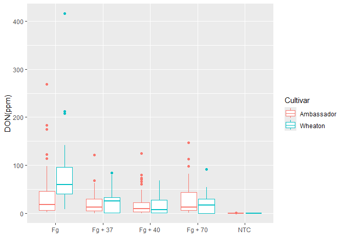
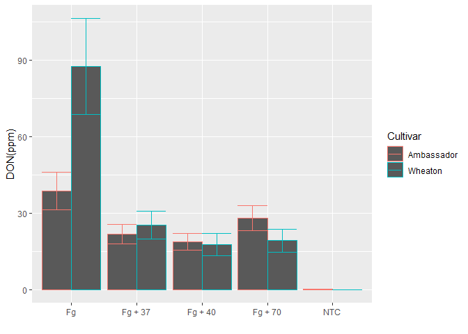
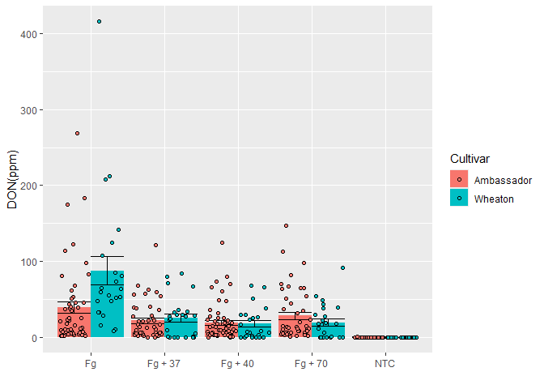
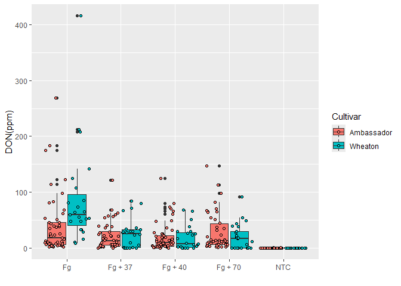
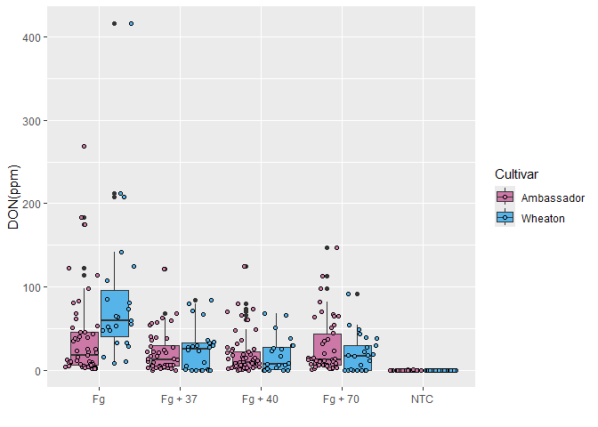
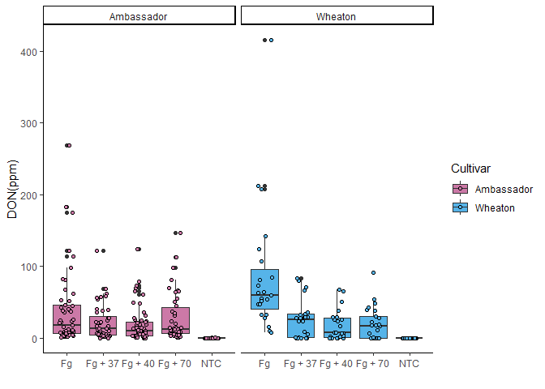
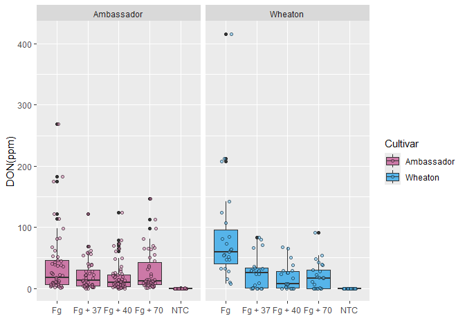
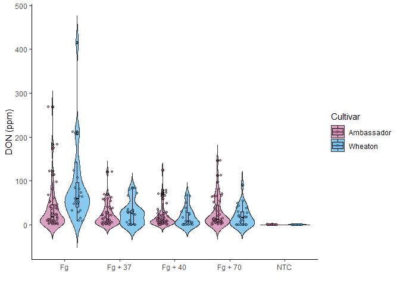

``` r
#read the data
Mycotoxin <- read.csv("02_Visualization/MycotoxinData.csv", na.strings = "na")

#load library
library(ggplot2)

#plot code
ggplot(Mycotoxin, aes(Treatment, DON, color = Cultivar))+ #define data, provide x and y axis through aesthetics, color the plot according to cultivar
  geom_boxplot()+
  xlab("")+ #label for x axis
  ylab("DON(ppm)") #label for y axis
```

    ## Warning: Removed 8 rows containing non-finite outside the scale range
    ## (`stat_boxplot()`).

<!-- -->

``` r
#bargraph
ggplot(Mycotoxin, aes(Treatment, DON, color = Cultivar))+
  stat_summary(fun = mean, geom= "bar", position ="dodge")+ #calculate summary output using stat_summary and plot the mean as bar. The postion dodge separates the bar out of the column
  stat_summary(fun.data = mean_se, geom = "errorbar", position = "dodge")+ #calculate standard error from mean and plot error bar.
  xlab("")+
  ylab("DON(ppm)")
```

    ## Warning: Removed 8 rows containing non-finite outside the scale range
    ## (`stat_summary()`).

    ## Warning: Removed 8 rows containing non-finite outside the scale range
    ## (`stat_summary()`).

<!-- -->

``` r
#jitteradded to bar plot
ggplot(Mycotoxin, aes(Treatment, DON, fill = Cultivar))+
  stat_summary(fun = mean, geom= "bar", position ="dodge")+
  stat_summary(fun.data = mean_se, geom = "errorbar", position = "dodge")+
  xlab("")+
  ylab("DON(ppm)") +
  geom_point(shape= 21, colour = "black", position = position_jitterdodge(dodge.width = 0.9)) #add jitter with empty circle as shape, black color and jitter are moves separate from the column
```

    ## Warning: Removed 8 rows containing non-finite outside the scale range
    ## (`stat_summary()`).
    ## Removed 8 rows containing non-finite outside the scale range
    ## (`stat_summary()`).

    ## Warning: Removed 8 rows containing missing values or values outside the scale range
    ## (`geom_point()`).

<!-- -->

``` r
#jitteradded to boxplot
ggplot(Mycotoxin, aes(Treatment, DON, fill = Cultivar))+
  geom_boxplot()+
  xlab("")+
  ylab("DON(ppm)")+
  geom_point( position = position_jitterdodge(dodge.width = 0.9), shape= 21, color = "black")
```

    ## Warning: Removed 8 rows containing non-finite outside the scale range
    ## (`stat_boxplot()`).
    ## Removed 8 rows containing missing values or values outside the scale range
    ## (`geom_point()`).

<!-- -->

``` r
#load cbb palette
cbbPalette <- c( "#CC79A7","#56B4E9","#009E73","#E69F00", "#F0E442", "#0072B2", "#D55E00" )

ggplot(Mycotoxin, aes(Treatment, DON, fill = Cultivar))+
  geom_boxplot()+
  scale_fill_manual(values = cbbPalette)+ #provide cbbPalette to the ggplot to use the color palette while using fill function
  xlab("")+
  ylab("DON(ppm)")+
  geom_point(position = position_jitterdodge(dodge.width = 0.9), shape= 21)
```

    ## Warning: Removed 8 rows containing non-finite outside the scale range
    ## (`stat_boxplot()`).
    ## Removed 8 rows containing missing values or values outside the scale range
    ## (`geom_point()`).

<!-- -->

``` r
#faceting
ggplot(Mycotoxin, aes(Treatment, DON, fill = Cultivar))+
  geom_boxplot()+
  theme_classic()+ #makes the background clean white
  scale_fill_manual(values = cbbPalette)+
  xlab("")+
  ylab("DON(ppm)")+
  geom_point(position = position_jitterdodge(dodge.width = 0.9), shape= 21)+
  facet_wrap(~Cultivar) #grouping the box plot according to the Cultivar
```

    ## Warning: Removed 8 rows containing non-finite outside the scale range
    ## (`stat_boxplot()`).
    ## Removed 8 rows containing missing values or values outside the scale range
    ## (`geom_point()`).

<!-- -->

``` r
#transparency to the point
ggplot(Mycotoxin, aes(Treatment, DON, fill = Cultivar))+
  geom_boxplot()+
  scale_fill_manual(values = cbbPalette)+
  xlab("")+
  ylab("DON(ppm)")+
  geom_point(position = position_jitterdodge(dodge.width = 0.9), shape= 21, colour = "black", alpha= 0.5)+ #alpha adds transparency to the point since its inside the command of geom_point
  facet_wrap(~Cultivar)
```

    ## Warning: Removed 8 rows containing non-finite outside the scale range
    ## (`stat_boxplot()`).
    ## Removed 8 rows containing missing values or values outside the scale range
    ## (`geom_point()`).

<!-- -->

``` r
##newplot for the data
#violin plot
ggplot(Mycotoxin, aes(x = Treatment, y = DON, fill = Cultivar)) +
  geom_violin(scale = "width", trim = FALSE, alpha = 0.7) + #scale width makes sure all violins are of same width
   theme_classic()+
  scale_fill_manual(values = cbbPalette) +
  xlab("") +
  ylab("DON (ppm)") +
  geom_boxplot(width = 0.1, color = "black", alpha = 0.5, position = position_dodge(0.9)) + #add boxplot inside
  geom_point(position = position_jitterdodge(dodge.width = 0.9, jitter.width = 0.2), alpha = 0.7, size = 1, shape = 21, color = "black")
```

    ## Warning: Removed 8 rows containing non-finite outside the scale range
    ## (`stat_ydensity()`).

    ## Warning: Removed 8 rows containing non-finite outside the scale range
    ## (`stat_boxplot()`).

    ## Warning: Removed 8 rows containing missing values or values outside the scale range
    ## (`geom_point()`).

<!-- -->
