## Using Inbuild dataset

``` r
#inbuild dataset
data("mtcars")
#check structure of data
str(mtcars)
```

    ## 'data.frame':    32 obs. of  11 variables:
    ##  $ mpg : num  21 21 22.8 21.4 18.7 18.1 14.3 24.4 22.8 19.2 ...
    ##  $ cyl : num  6 6 4 6 8 6 8 4 4 6 ...
    ##  $ disp: num  160 160 108 258 360 ...
    ##  $ hp  : num  110 110 93 110 175 105 245 62 95 123 ...
    ##  $ drat: num  3.9 3.9 3.85 3.08 3.15 2.76 3.21 3.69 3.92 3.92 ...
    ##  $ wt  : num  2.62 2.88 2.32 3.21 3.44 ...
    ##  $ qsec: num  16.5 17 18.6 19.4 17 ...
    ##  $ vs  : num  0 0 1 1 0 1 0 1 1 1 ...
    ##  $ am  : num  1 1 1 0 0 0 0 0 0 0 ...
    ##  $ gear: num  4 4 4 3 3 3 3 4 4 4 ...
    ##  $ carb: num  4 4 1 1 2 1 4 2 2 4 ...

``` r
#scatter plot using base R
plot(mtcars$wt, mtcars$mpg)
```

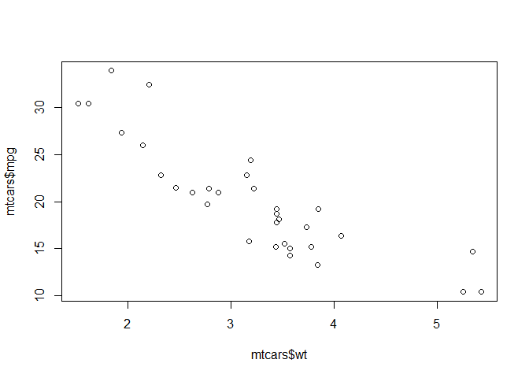<!-- -->

``` r
#fancying same plot
plot(mtcars$wt, mtcars$mpg, 
     xlab = "Car weight",
     ylab = "Miles per gallon",
     font.lab = 6,
     pch = 23) #pch: printing character, shape used in plot
```

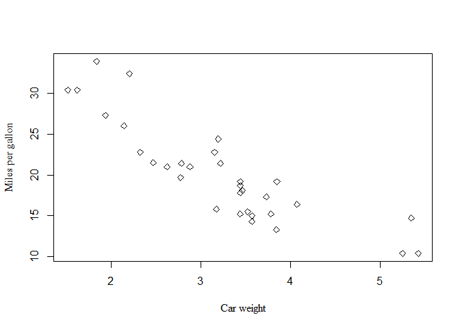<!-- -->

## Scatter Plot

``` r
library(ggplot2)
ggplot() #no plot but did infact work
```

<!-- -->

``` r
ggplot(mtcars, aes(x = wt,y = mpg)) #don't need to define the data before the column, just use column name
```

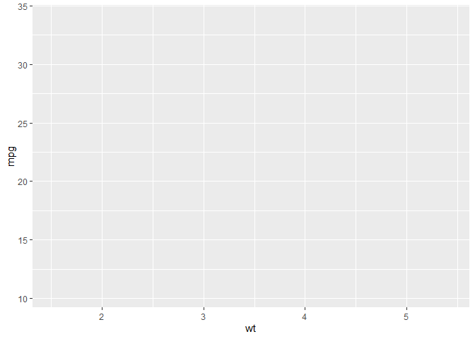<!-- -->

``` r
#ggplot is in the concept of layers so need more information for data structure 

ggplot(mtcars, aes(x = wt,y = mpg)) +
  geom_point() +  #we told to put a layer for data points
  geom_smooth(method = lm, se = FALSE) #makes line smooth and method lm gives it a linear model and makes a best fitting model for linear relationship, se FALSE removes confidence interval
```

    ## `geom_smooth()` using formula = 'y ~ x'

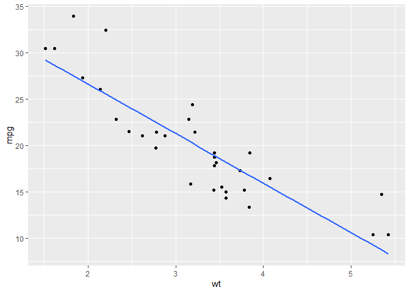<!-- -->

``` r
#if you want to change how things are layered. For example; if you don't want the line to cover points, change the order for it.
ggplot(mtcars, aes(x = wt,y = mpg, size = wt)) + #change the size of point according to weight which is applied to all the command along the line in all layers
 geom_smooth(method = lm, se = FALSE, color = "grey") +
  geom_point(color = "blue") + #add the changes you want to do in the code where it is mentioned, here I put the color blue to change the color of points
  xlab("Weight") +
  ylab("Miles per gallon")
```

    ## Warning: Using `size` aesthetic for lines was deprecated in ggplot2 3.4.0.
    ## ℹ Please use `linewidth` instead.
    ## This warning is displayed once every 8 hours.
    ## Call `lifecycle::last_lifecycle_warnings()` to see where this warning was
    ## generated.

    ## `geom_smooth()` using formula = 'y ~ x'

    ## Warning: The following aesthetics were dropped during statistical transformation: size.
    ## ℹ This can happen when ggplot fails to infer the correct grouping structure in
    ##   the data.
    ## ℹ Did you forget to specify a `group` aesthetic or to convert a numerical
    ##   variable into a factor?

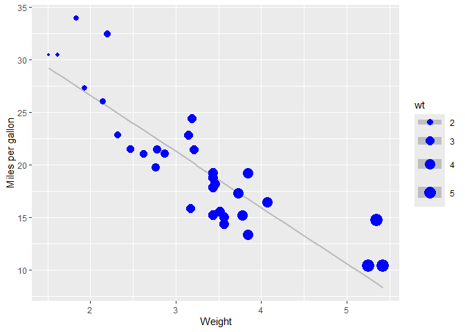<!-- -->

``` r
ggplot(mtcars, aes(x = wt,y = mpg)) + 
 geom_smooth(method = lm, se = FALSE, color = "grey") +
  geom_point(aes(size = wt), color = "blue") + #adding aesthetic to the point only change the point and not the all layers
  xlab("Weight") +
  ylab("Miles per gallon")
```

    ## `geom_smooth()` using formula = 'y ~ x'

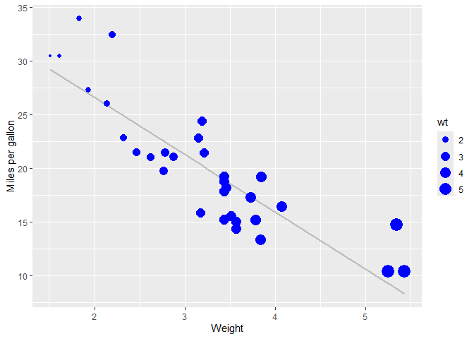<!-- -->

``` r
ggplot(mtcars, aes(x = wt,y = mpg)) + 
 geom_smooth(method = lm, se = FALSE, color = "grey") +
  geom_point(aes(size = wt, color = wt)) + #putting the color within the aesthetic changes the color of the points too according to the weight
  xlab("Weight") +
  ylab("Miles per gallon")
```

    ## `geom_smooth()` using formula = 'y ~ x'

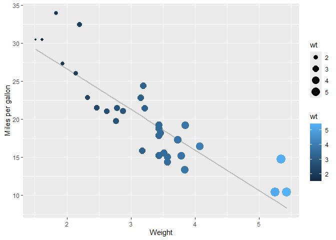<!-- -->

``` r
##changing the variables for size and color
ggplot(mtcars, aes(x = wt,y = mpg)) + 
 geom_smooth(method = lm, se = FALSE, color = "grey") +
  geom_point(aes(size = cyl, color = hp)) + #change the variable for size and color here
  xlab("Weight") +
  ylab("Miles per gallon")
```

    ## `geom_smooth()` using formula = 'y ~ x'

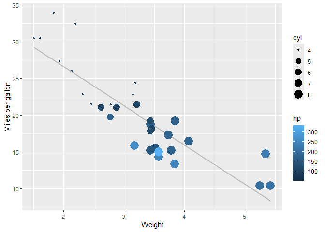<!-- -->

``` r
##providing gradient of color
ggplot(mtcars, aes(x = wt,y = mpg)) + 
 geom_smooth(method = lm, se = FALSE, color = "grey") +
  geom_point(aes(size = cyl, color = hp)) + 
  xlab("Weight") +
  ylab("Miles per gallon") +
  scale_color_gradient(low = "green", high = "black") + #providing gradient for the point
  scale_x_log10() #scaling for x axis with log10 
```

    ## `geom_smooth()` using formula = 'y ~ x'

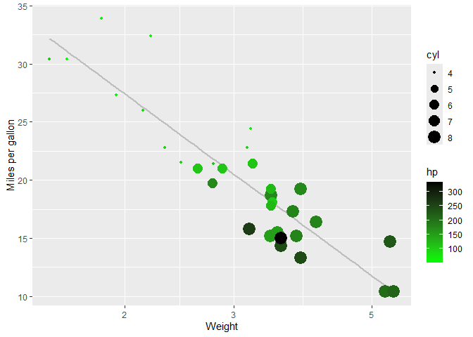<!-- -->

``` r
  # + scale_y_continuous(labels = scales::percent) #scaling y axis into percentage
```

## Box Plot

``` r
bull.richness <- read.csv("02_Visualization/Bull_richness.csv")
bull.richness.soy.no.till <- bull.richness[bull.richness$Crop == "Soy" &
                                             bull.richness$Treatment == "No-till",] #subset for soy and no till

ggplot(bull.richness.soy.no.till, aes(x = GrowthStage, y = richness, color = Fungicide)) +
  geom_boxplot() + #easy and traditional 
  xlab("")+
  ylab("Fungal Richness") +
  geom_point() #donot dodge the point
```

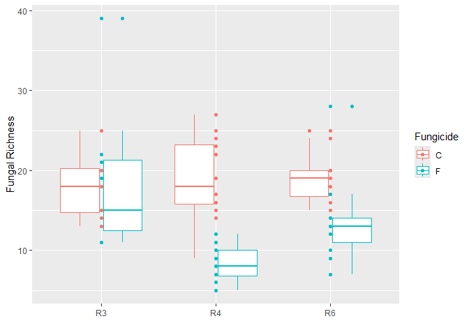<!-- -->

``` r
ggplot(bull.richness.soy.no.till, aes(x = GrowthStage, y = richness, color = Fungicide)) +
  geom_boxplot() + #easy and traditional 
  xlab("")+
  ylab("Fungal Richness") +
  geom_point(position = position_dodge(width = 0.9)) #dodge the point for the width of 0.9 from the column
```

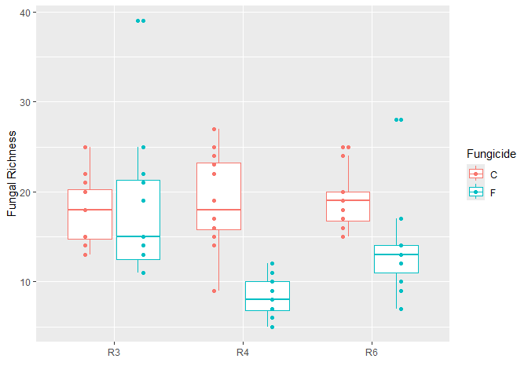<!-- -->

``` r
ggplot(bull.richness.soy.no.till, aes(x = GrowthStage, y = richness, color = Fungicide)) +
  geom_boxplot() + 
  xlab("")+
  ylab("Fungal Richness") +
  geom_point(position = position_jitterdodge(dodge.width = 0.9)) #dodge from the position and jitterdodge for not overlapping the points
```

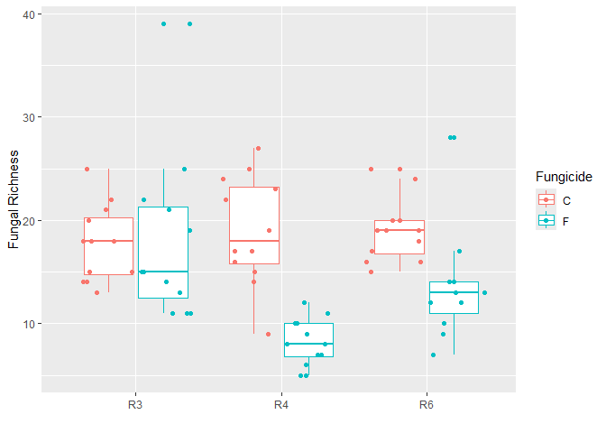<!-- -->
\## Bar Chart

``` r
#stat mean calculate the mean and plot it as bar
ggplot(bull.richness.soy.no.till, aes(x = GrowthStage, y = richness, color = Fungicide, fill = Fungicide)) + #change the color into fill to fill the whole bar with color and keep the color command too to keep the error bar and point color as same as bars
  stat_summary(fun = mean, geom = "bar", position = "dodge") + #stat summary calculate all summary and fun.mean plots the mean as a bar
  stat_summary(fun.data = mean_se, geom = "errorbar", position = "dodge" )+
  xlab("")+
  ylab("Fungal Richness") +
  geom_point(position = position_jitterdodge(dodge.width = 0.9)) #dodge the point for the width of 0.9 from the column
```

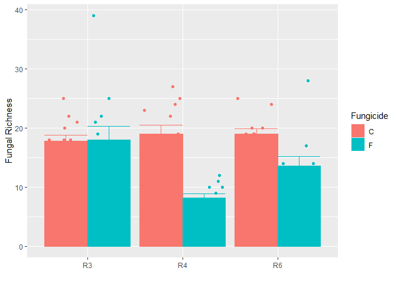<!-- -->
\## Line Chart

``` r
ggplot(bull.richness.soy.no.till, aes(x = GrowthStage, y = richness, group = Fungicide, color = Fungicide)) + #grouping variable as Fungicide that allow us to draw line from one to the other within the same group
  stat_summary(fun = mean, geom = "line") + #stat summary calculate all summary and fun.mean plots the mean as a line
  stat_summary(fun.data = mean_se, geom = "errorbar")+
  xlab("")+
  ylab("Fungal Richness") 
```

<!-- -->
\## Faceting

``` r
ggplot(bull.richness, aes(x = GrowthStage, y = richness, group = Fungicide, color = Fungicide))+
  stat_summary(fun = mean, geom = "line")+
  stat_summary(fun.data = mean_se, geom = "errorbar")+
  xlab("")+
  ylab("Fungal Richness")+
  facet_wrap(~Crop*Treatment, scales = "free") #groups the graph for different treatments and scales free removes the unused bar area. We can also swap things around to change the order of treatments.
```

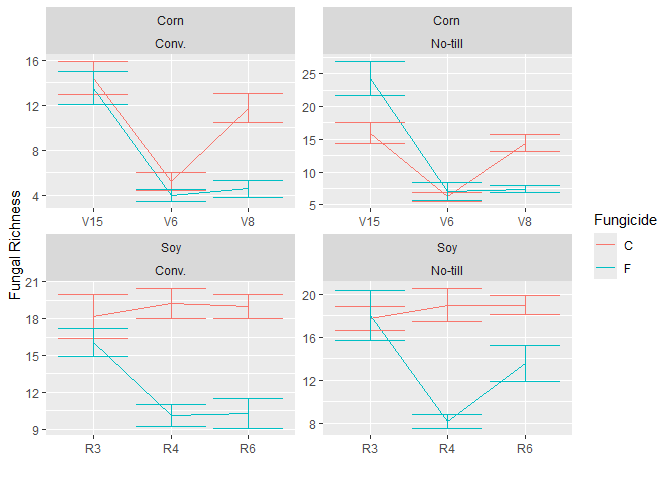<!-- -->
