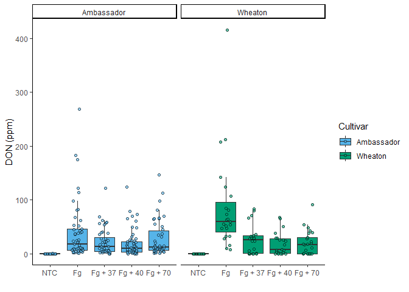
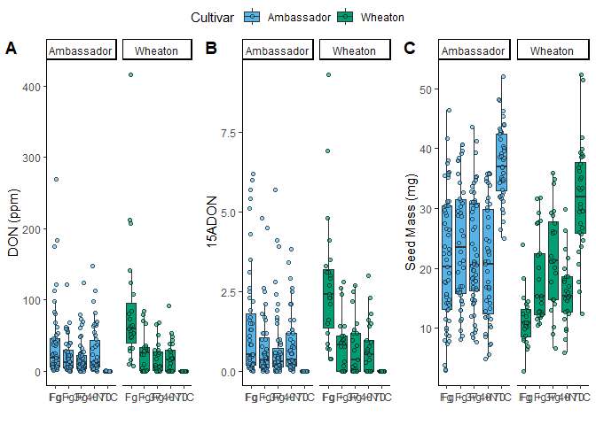
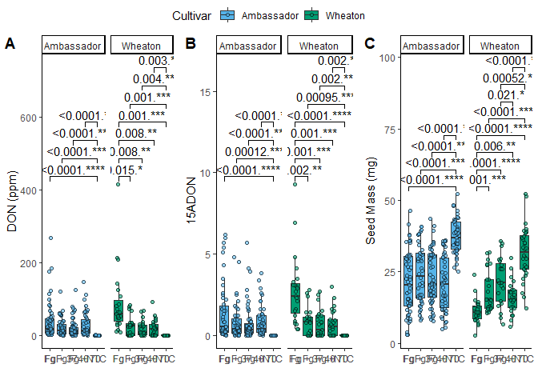

# Question1

``` r
#read data
Mycotoxin <- read.csv("03_Visualization/MycotoxinData.csv", na.strings = "na")
#load library
library(ggplot2)
#load pallette
cbbPalette <- c("#56B4E9", "#009E73", "#F0E442", "#0072B2", "#D55E00", "#CC79A7")
#making box plot
DON <- ggplot(Mycotoxin, aes(x = Treatment, y = DON, fill = Cultivar))+
  geom_boxplot(outlier.shape = NA)+ #removing NA outliers from the boxplot
  geom_point(shape = 21, color = "black", position = position_jitterdodge(dodge.width = 0.9), alpha = 0.6 )+ #giving shape to fill the color and dodge away from the bar plot, alpha value provides transparency to the points
  scale_fill_manual(values = cbbPalette)+
  theme_classic()+
  xlab("")+
  ylab("DON (ppm)")+
  facet_wrap(~Cultivar) #facet wrap according to the Cultivar, here I didnot use scale free since all all the plot space is used.
```

# Question2

``` r
#changing the order label
str(Mycotoxin)
```

    ## 'data.frame':    375 obs. of  6 variables:
    ##  $ Treatment     : chr  "Fg" "Fg" "Fg" "Fg" ...
    ##  $ Cultivar      : chr  "Wheaton" "Wheaton" "Wheaton" "Wheaton" ...
    ##  $ BioRep        : int  2 2 2 2 2 2 2 2 2 3 ...
    ##  $ MassperSeed_mg: num  10.29 12.8 2.85 6.5 10.18 ...
    ##  $ DON           : num  107.3 32.6 416 211.9 124 ...
    ##  $ X15ADON       : num  3 0.85 3.5 3.1 4.8 3.3 6.9 2.9 2.1 0.71 ...

``` r
#changing the factor levels
Mycotoxin$Mycotoxin_reordered <- factor(Mycotoxin$Treatment, levels = c("NTC", "Fg", "Fg + 37", "Fg + 40", "Fg + 70")) 

#making plot using reordered Treatment (x-axis)
ggplot(Mycotoxin, aes(Mycotoxin_reordered, DON, fill = Cultivar))+ #change x axis only since the data is ordered for that column
  geom_boxplot(outlier.shape = NA)+ #removing NA outliers from the boxplot
  geom_point(shape = 21, color = "black", position = position_jitterdodge(dodge.width = 0.9), alpha=0.6 )+ 
  scale_fill_manual(values = cbbPalette)+ 
  theme_classic()+
  xlab("")+
  ylab("DON (ppm)")+
  facet_wrap(~Cultivar)
```

    ## Warning: Removed 8 rows containing non-finite outside the scale range
    ## (`stat_boxplot()`).

    ## Warning: Removed 8 rows containing missing values or values outside the scale range
    ## (`geom_point()`).

<!-- -->
\# Question3

``` r
#making y-axis as 15ADON 
X15ADON <- ggplot(Mycotoxin, aes(Treatment, X15ADON, fill = Cultivar))+ #change x axis only since the data is ordered for that column
  geom_boxplot(outlier.shape = NA)+ #removing NA outliers from the boxplot
  geom_point(shape = 21, color = "black", position = position_jitterdodge(dodge.width = 0.9), alpha=0.6 )+ 
  scale_fill_manual(values = cbbPalette)+
  theme_classic()+
  xlab("")+
  ylab("15ADON")+
  facet_wrap(~Cultivar)

#making y-axis as mass per seed
Seedmass <- ggplot(Mycotoxin, aes(Treatment, MassperSeed_mg, fill = Cultivar))+ 
  geom_boxplot(outlier.shape = NA)+
  geom_point(shape = 21, color = "black", position = position_jitterdodge(dodge.width = 0.9), alpha=0.6 )+
  scale_fill_manual(values = cbbPalette)+
  theme_classic()+
  xlab("")+
  ylab("Seed Mass (mg)")+
  facet_wrap(~Cultivar)
```

# Question4

``` r
#load library 
library(ggpubr)

combined <- ggarrange(
  DON,
  X15ADON,
  Seedmass,
  nrow=1, #number of rows
  ncol=3, #number of columns
  labels = "AUTO", #label AUTO in caps provide label in UPPERCASE
  common.legend= TRUE #provide common legend to all the plots combined, default is False mean we get legend for each plot separately
)
```

    ## Warning: Removed 8 rows containing non-finite outside the scale range
    ## (`stat_boxplot()`).

    ## Warning: Removed 8 rows containing missing values or values outside the scale range
    ## (`geom_point()`).

    ## Warning: Removed 8 rows containing non-finite outside the scale range
    ## (`stat_boxplot()`).

    ## Warning: Removed 8 rows containing missing values or values outside the scale range
    ## (`geom_point()`).

    ## Warning: Removed 10 rows containing non-finite outside the scale range
    ## (`stat_boxplot()`).

    ## Warning: Removed 10 rows containing missing values or values outside the scale range
    ## (`geom_point()`).

    ## Warning: Removed 2 rows containing non-finite outside the scale range
    ## (`stat_boxplot()`).

    ## Warning: Removed 2 rows containing missing values or values outside the scale range
    ## (`geom_point()`).

``` r
combined
```

<!-- -->
\# Question5

``` r
DON_stat <- DON+
  geom_pwc(aes(group = Treatment), method = "t.test", label = "{p.adj.format}.{p.adj.signif}", hide.ns = T) # takes Treatment as a group to compare using t-test and provides label for p-adjusted value and significance. It was looking busy so I removes the ns using hide.ns

X15ADON_stat <- X15ADON+
  geom_pwc(aes(group = Treatment), method = "t.test", label = "{p.adj.format}.{p.adj.signif}", hide.ns = T)

Seedmass_stat <- Seedmass+
  geom_pwc(aes(group = Treatment), method = "t.test", label = "{p.adj.format}.{p.adj.signif}", hide.ns = T)


stat_plot <- ggarrange(
  DON_stat,
  X15ADON_stat,
  Seedmass_stat,
  ncol = 3,
  nrow = 1,
  labels = c("A", "B", "C"), #we can also provide label to the plot manually
  common.legend = T
)
```

    ## Warning: Removed 8 rows containing non-finite outside the scale range
    ## (`stat_boxplot()`).

    ## Warning: Removed 8 rows containing non-finite outside the scale range
    ## (`stat_pwc()`).

    ## Warning: Removed 8 rows containing missing values or values outside the scale range
    ## (`geom_point()`).

    ## Warning: Removed 8 rows containing non-finite outside the scale range
    ## (`stat_boxplot()`).

    ## Warning: Removed 8 rows containing non-finite outside the scale range
    ## (`stat_pwc()`).

    ## Warning: Removed 8 rows containing missing values or values outside the scale range
    ## (`geom_point()`).

    ## Warning: Removed 10 rows containing non-finite outside the scale range
    ## (`stat_boxplot()`).

    ## Warning: Removed 10 rows containing non-finite outside the scale range
    ## (`stat_pwc()`).

    ## Warning: Removed 10 rows containing missing values or values outside the scale range
    ## (`geom_point()`).

    ## Warning: Removed 2 rows containing non-finite outside the scale range
    ## (`stat_boxplot()`).

    ## Warning: Removed 2 rows containing non-finite outside the scale range
    ## (`stat_pwc()`).

    ## Warning: Removed 2 rows containing missing values or values outside the scale range
    ## (`geom_point()`).

``` r
stat_plot
```

<!-- -->
