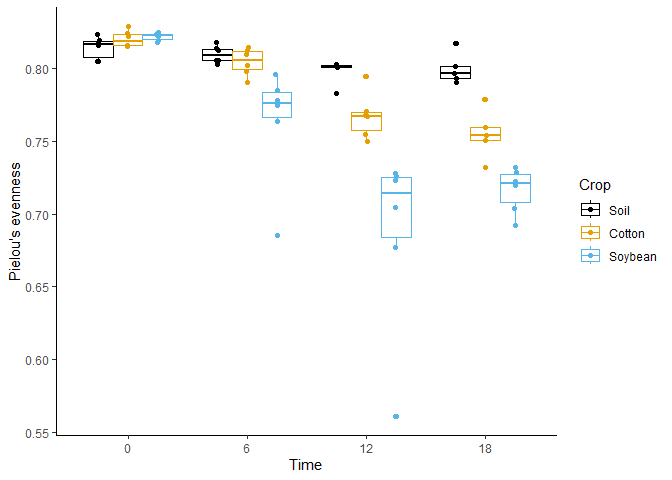
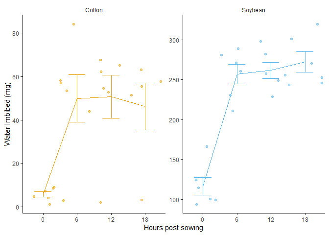
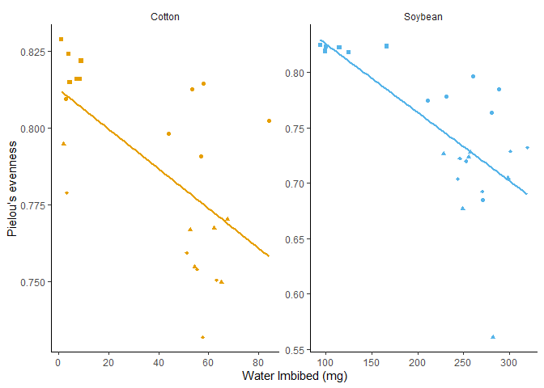
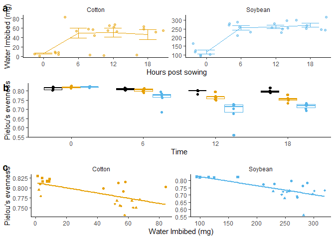
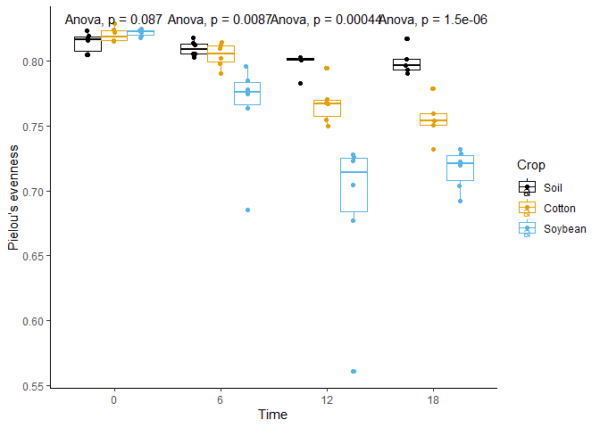
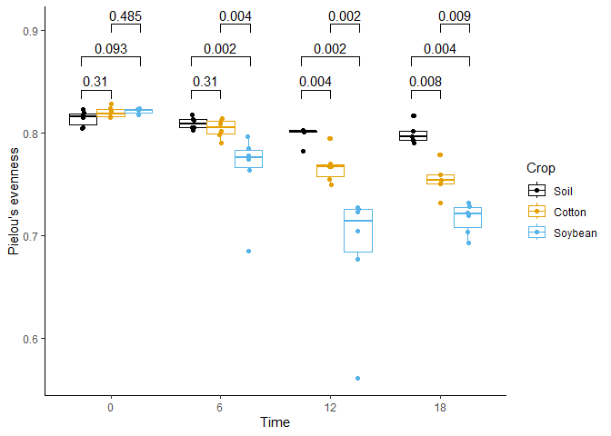
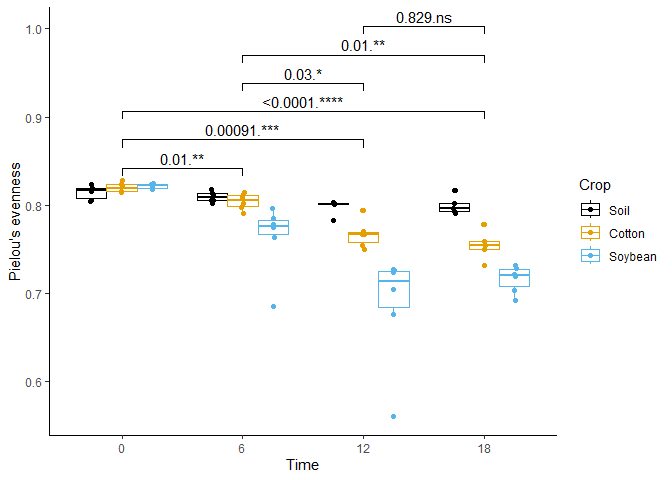
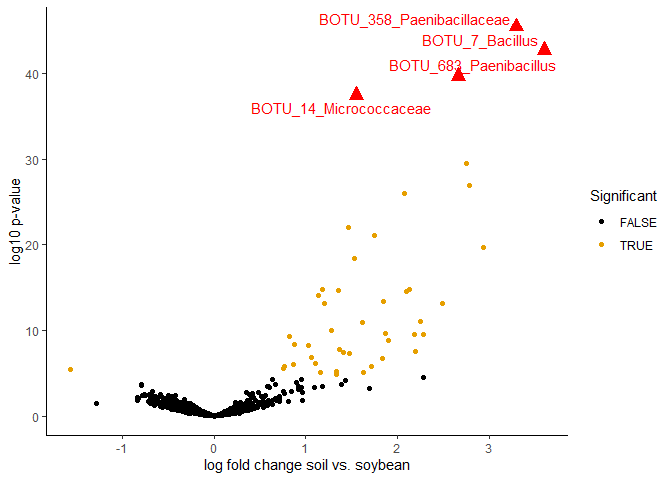

``` r
#load libraries
library(tidyverse)
```

    ## ── Attaching core tidyverse packages ──────────────────────── tidyverse 2.0.0 ──
    ## ✔ dplyr     1.1.4     ✔ readr     2.1.5
    ## ✔ forcats   1.0.0     ✔ stringr   1.5.1
    ## ✔ ggplot2   3.5.1     ✔ tibble    3.2.1
    ## ✔ lubridate 1.9.4     ✔ tidyr     1.3.1
    ## ✔ purrr     1.0.2     
    ## ── Conflicts ────────────────────────────────────────── tidyverse_conflicts() ──
    ## ✖ dplyr::filter() masks stats::filter()
    ## ✖ dplyr::lag()    masks stats::lag()
    ## ℹ Use the conflicted package (<http://conflicted.r-lib.org/>) to force all conflicts to become errors

``` r
library(ggpubr)
library(ggrepel) #useful for labeling points
library(ggplot2)

#color consistency and assessibility for variables along different plots makes it easier to understand

cbbPalette <- c("#000000", "#E69F00", "#56B4E9", "#009E73", "#F0E442", "#0072B2", "#D55E00", "#CC79A7")

sample.data.bac <- read.csv("03_Visualization/BacterialAlpha.csv", na.strings = "na")
sample.data.bac
```

    ##        Code    Crop Time_Point Replicate Water_Imbibed  shannon invsimpson
    ## 1    S01_13    Soil          0         1            NA 6.624921  210.72795
    ## 2    S02_16    Soil          0         2            NA 6.612413  206.86664
    ## 3    S03_19    Soil          0         3            NA 6.660853  213.01843
    ## 4    S04_22    Soil          0         4            NA 6.660671  204.69080
    ## 5    S05_25    Soil          0         5            NA 6.610965  200.25523
    ## 6    S06_28    Soil          0         6            NA 6.650812  199.32110
    ## 7    S61_32    Soil          6         1            NA 6.570679  200.23177
    ## 8    S62_35    Soil          6         2            NA 6.492227  171.27965
    ## 9    S63_38    Soil          6         3            NA 6.610986  192.08535
    ## 10   S64_41    Soil          6         4            NA 6.472259  163.99814
    ## 11   S65_44    Soil          6         5            NA 6.508824  181.69248
    ## 12   S66_47    Soil          6         6            NA 6.482495  176.90684
    ## 13  S121_51    Soil         12         1            NA 6.276073  126.56259
    ## 14  S122_54    Soil         12         2            NA 6.461118  152.98152
    ## 15  S123_57    Soil         12         3            NA 6.334648  138.92556
    ## 16  S124_60    Soil         12         4            NA 6.461988  171.13732
    ## 17  S125_63    Soil         12         5            NA 6.501973  172.97532
    ## 18  S126_66    Soil         12         6            NA 6.354387  142.61016
    ## 19  S181_70    Soil         18         1            NA 6.299381  142.64506
    ## 20  S182_74    Soil         18         2            NA 6.340644  145.48656
    ## 21  S183_78    Soil         18         3            NA 6.282807  150.39829
    ## 22  S184_82    Soil         18         4            NA 6.268316  141.14138
    ## 23  S186_90    Soil         18         6            NA 6.289000  140.45260
    ## 24   C01_11  Cotton          0         1        0.0042 6.618126  220.66218
    ## 25   C02_14  Cotton          0         2        0.0091 6.627206  211.03921
    ## 26   C03_17  Cotton          0         3        0.0013 6.616958  216.06631
    ## 27   C04_20  Cotton          0         4        0.0087 6.626465  215.93901
    ## 28   C05_23  Cotton          0         5        0.0075 6.642822  211.08960
    ## 29   C06_26  Cotton          0         6        0.0046 6.679131  216.31351
    ## 30   C61_30  Cotton          6         1        0.0580 6.454741  170.03639
    ## 31   C62_33  Cotton          6         2        0.0440 6.484032  172.35279
    ## 32   C63_36  Cotton          6         3        0.0569 6.517958  173.41489
    ## 33   C64_39  Cotton          6         4        0.0841 6.476069  167.13138
    ## 34   C65_42  Cotton          6         5        0.0535 6.569722  197.01186
    ## 35   C66_45  Cotton          6         6        0.0029 6.482145  172.96394
    ## 36  C121_49  Cotton         12         1        0.0651 5.944568   71.55607
    ## 37  C122_52  Cotton         12         2        0.0527 6.187755   96.43939
    ## 38  C123_55  Cotton         12         3        0.0675 6.129460   81.26646
    ## 39  C124_58  Cotton         12         4        0.0545 6.028523   75.49726
    ## 40  C125_61  Cotton         12         5        0.0623 6.148179   98.94468
    ## 41  C126_64  Cotton         12         6        0.0021 6.347332  150.05708
    ## 42  C181_68  Cotton         18         1        0.0034 6.301392  132.36230
    ## 43  C182_72  Cotton         18         2        0.0632 6.000205   83.90929
    ## 44  C183_76  Cotton         18         3        0.0514 5.981284   82.44127
    ## 45  C184_80  Cotton         18         4        0.0577 5.578566   50.73174
    ## 46  C185_84  Cotton         18         5        0.0554 6.064655   87.82732
    ## 47  SB01_12 Soybean          0         1        0.1664 6.644864  216.86110
    ## 48  SB02_15 Soybean          0         2        0.0942 6.615662  211.32573
    ## 49  SB03_18 Soybean          0         3        0.1248 6.693987  230.45439
    ## 50  SB04_21 Soybean          0         4        0.1150 6.647502  234.80343
    ## 51  SB05_24 Soybean          0         5        0.0993 6.605749  198.57265
    ## 52  SB06_27 Soybean          0         6        0.1005 6.640696  215.26494
    ## 53  SB61_31 Soybean          6         1        0.2308 6.044229   89.13912
    ## 54  SB62_34 Soybean          6         2        0.2603 6.437589  154.21624
    ## 55  SB63_37 Soybean          6         3        0.2111 6.194632   83.11681
    ## 56  SB64_40 Soybean          6         4        0.2808 6.117393   87.20257
    ## 57  SB65_43 Soybean          6         5        0.2712 5.439798   29.48338
    ## 58  SB66_46 Soybean          6         6        0.2887 6.195816  108.22394
    ## 59 SB121_50 Soybean         12         1        0.2822 4.393341   12.39587
    ## 60 SB122_53 Soybean         12         2        0.2557 5.630929   52.97931
    ## 61 SB123_56 Soybean         12         3        0.2982 5.579523   48.59842
    ## 62 SB124_59 Soybean         12         4        0.2489 5.406651   34.08685
    ## 63 SB125_62 Soybean         12         5        0.2573 5.863941   63.33020
    ## 64 SB126_65 Soybean         12         6        0.2285 5.738025   57.88780
    ## 65 SB181_69 Soybean         18         1        0.2528 5.671024   57.37726
    ## 66 SB182_73 Soybean         18         2        0.2706 5.489406   43.16854
    ## 67 SB183_77 Soybean         18         3        0.3196 5.713960   60.47882
    ## 68 SB184_81 Soybean         18         4        0.2437 5.467076   44.06798
    ## 69 SB185_85 Soybean         18         5        0.2461 5.729473   55.95864
    ## 70 SB186_89 Soybean         18         6        0.3010 5.556356   54.34527
    ##      simpson richness      even
    ## 1  0.9952545     3319 0.8171431
    ## 2  0.9951660     3079 0.8232216
    ## 3  0.9953056     3935 0.8046776
    ## 4  0.9951146     3922 0.8049774
    ## 5  0.9950064     3196 0.8192376
    ## 6  0.9949830     3481 0.8155427
    ## 7  0.9950058     3250 0.8125582
    ## 8  0.9941616     3170 0.8053387
    ## 9  0.9947940     3657 0.8057856
    ## 10 0.9939024     3177 0.8026420
    ## 11 0.9944962     2985 0.8134652
    ## 12 0.9943473     2770 0.8178151
    ## 13 0.9920988     3040 0.7825905
    ## 14 0.9934633     3192 0.8007927
    ## 15 0.9928019     2673 0.8027732
    ## 16 0.9941567     3180 0.8012745
    ## 17 0.9942188     3320 0.8019483
    ## 18 0.9929879     2773 0.8015438
    ## 19 0.9929896     2806 0.7934213
    ## 20 0.9931265     3047 0.7904155
    ## 21 0.9933510     2190 0.8168340
    ## 22 0.9929149     2488 0.8016534
    ## 23 0.9928802     2684 0.7965737
    ## 24 0.9954682     3076 0.8240330
    ## 25 0.9952615     3180 0.8217613
    ## 26 0.9953718     2938 0.8286233
    ## 27 0.9953691     3371 0.8157692
    ## 28 0.9952627     3435 0.8158938
    ## 29 0.9953771     3629 0.8148549
    ## 30 0.9941189     2767 0.8144250
    ## 31 0.9941979     3377 0.7980600
    ## 32 0.9942335     3804 0.7906489
    ## 33 0.9940167     3204 0.8022726
    ## 34 0.9949242     3250 0.8124399
    ## 35 0.9942184     3009 0.8093209
    ## 36 0.9860249     2779 0.7496447
    ## 37 0.9896308     3193 0.7668822
    ## 38 0.9876948     2859 0.7702042
    ## 39 0.9867545     2950 0.7545500
    ## 40 0.9898933     3018 0.7673379
    ## 41 0.9933359     2946 0.7945881
    ## 42 0.9924450     3266 0.7787840
    ## 43 0.9880824     2969 0.7504026
    ## 44 0.9878702     2636 0.7593336
    ## 45 0.9802885     2043 0.7318864
    ## 46 0.9886140     3113 0.7539969
    ## 47 0.9953888     3203 0.8232153
    ## 48 0.9952680     3055 0.8244294
    ## 49 0.9956607     3595 0.8176063
    ## 50 0.9957411     3253 0.8219646
    ## 51 0.9949641     3187 0.8188774
    ## 52 0.9953546     3190 0.8231136
    ## 53 0.9887816     2371 0.7777862
    ## 54 0.9935156     3248 0.7961603
    ## 55 0.9879687     2976 0.7744902
    ## 56 0.9885324     3006 0.7638754
    ## 57 0.9660826     2809 0.6850627
    ## 58 0.9907599     2680 0.7849191
    ## 59 0.9193280     2508 0.5612885
    ## 60 0.9811247     2403 0.7233538
    ## 61 0.9794232     2752 0.7044778
    ## 62 0.9706632     2946 0.6768294
    ## 63 0.9842097     3165 0.7275444
    ## 64 0.9827252     2705 0.7260697
    ## 65 0.9825715     2642 0.7197378
    ## 66 0.9768350     2773 0.6924349
    ## 67 0.9834653     2454 0.7320451
    ## 68 0.9773078     2365 0.7037462
    ## 69 0.9821297     2789 0.7221929
    ## 70 0.9815991     2050 0.7286456

``` r
#making variable into categorical
sample.data.bac$Time_Point <- as.factor(sample.data.bac$Time_Point)
sample.data.bac$Crop <- as.factor(sample.data.bac$Crop)

#by changing the factor level, we can change the way ggplot plots the data
sample.data.bac$Crop <- factor(sample.data.bac$Crop, levels = c("Soil", "Cotton", "Soybean"))

#plot 1-B
bac.even <- ggplot(sample.data.bac, aes(x = Time_Point, y = even, color = Crop)) +
  geom_boxplot(position = position_dodge()) +
  geom_point(position = position_jitterdodge(0.05)) +
  xlab("Time") +
  ylab("Pielou's evenness") +
  scale_color_manual(values = cbbPalette)+
  theme_classic()
bac.even
```

<!-- -->

``` r
# Plot 2-A
sample.data.bac.no.soil <- subset(sample.data.bac, Crop != "Soil") #subset the file without soil data; != means not equal to

water.imbibed <- ggplot(sample.data.bac.no.soil, aes(Time_Point, 1000 * Water_Imbibed, color = Crop)) +  # Define aesthetics: x-axis as Time.Point, y-axis as Water_Imbibed (converted to mg), and color by Crop
  geom_jitter(width = 0.5, alpha = 0.5) +  # Add jittered points to show individual data points with some transparency
  stat_summary(fun = mean, geom = "line", aes(group = Crop)) +  # Add lines representing the mean value for each Crop group
  stat_summary(fun.data = mean_se, geom = "errorbar", width = 0.5) +  # Add error bars representing the standard error of the mean
  xlab("Hours post sowing") +  # Label the x-axis
  ylab("Water Imbibed (mg)") +  # Label the y-axis
  scale_color_manual(values = c(cbbPalette[[2]], cbbPalette[[3]]), name = "", labels = c("", "")) +  # Manually set colors for the Crop variable
  theme_classic() +  # Use a classic theme for the plot
  theme(strip.background = element_blank(), legend.position = "none") +  # Customize theme: remove strip background and remove the legends
  facet_wrap(~Crop, scales = "free")  # Create separate panels for each Crop, allowing free scales
water.imbibed
```

<!-- -->

``` r
#Plot 3- C
water.imbibed.cor <- ggplot(sample.data.bac.no.soil, aes(y = even, x = 1000 * Water_Imbibed, color = Crop)) +  # Define aesthetics: y-axis as even, x-axis as Water_Imbibed (converted to mg), and color by Crop
  geom_point(aes(shape = Time_Point)) +  # Add points with different shapes based on Time.Point
  geom_smooth(se = FALSE, method = lm) +  # Add a linear model smooth line (trend line) without confidence interval shading
  xlab("Water Imbibed (mg)") +  # Label the x-axis
  ylab("Pielou's evenness") +  # Label the y-axis
  scale_color_manual(values = c(cbbPalette[[2]], cbbPalette[[3]]), name = "", labels = c("Cotton", "Soybean")) +  # Manually set colors for the Crop variable
  scale_shape_manual(values = c(15, 16, 17, 18), name = "", labels = c("0 hrs", "6 hrs", "12 hrs", "18 hrs")) +  # Manually set shapes for the Time.Point variable
  theme_classic() +  # Use a classic theme for the plot
  guides(color = "none")+ #removes the color legend
  theme(strip.background = element_blank(), legend.position = "none") +
  facet_wrap(~Crop, scales = "free")  # Create separate panels for each Crop, allowing free scales
water.imbibed.cor
```

    ## `geom_smooth()` using formula = 'y ~ x'

<!-- -->

``` r
figure2 <- ggarrange(#use ggarrange to arrange all the figures together
  water.imbibed,
  bac.even,
  water.imbibed.cor,
  labels = "auto",
  nrow = 3, #number of rows for the figure
  ncol= 1, #number of columns for figure
  legend = FALSE
)
```

    ## `geom_smooth()` using formula = 'y ~ x'

``` r
figure2
```

<!-- -->
\###integrating statistics into the plots for exploratory analyses

``` r
#ggpubr integrate stats with actual plot itself
#anova type designs
bac.even +
  stat_compare_means(method = "anova") #provides anova inferences to the variable
```

<!-- -->

``` r
#more exploratory so p-value are not adjusted, using proper stats is important
bac.even +
  geom_pwc(aes(group = Crop, method = "t.test", label = "p.adj.format")) #display adjusted p-value and do the pairwise comparison test using t-test on the different crops.
```

    ## Warning in geom_pwc(aes(group = Crop, method = "t.test", label =
    ## "p.adj.format")): Ignoring unknown aesthetics: method

<!-- -->

``` r
bac.even +
  geom_pwc(aes(group = Time_Point), method = "t.test", label = "{p.adj.format}.{p.adj.signif}")
```

<!-- -->

``` r
#display adjusted p-value and significance for Time_point as group
water.imbibed.cor +
#stat_cor() + #display correlation Pearson's in default, have to change if we want Spearman's correlation
  stat_regline_equation() #display equation for the regression line
```

    ## `geom_smooth()` using formula = 'y ~ x'

<!-- -->

\##plot fold change

``` r
diff.abund <- read.csv("03_Visualization/diff_abund.csv", na.strings = "na")
str(diff.abund) #structure of the file
```

    ## 'data.frame':    2375 obs. of  16 variables:
    ##  $ taxon           : chr  "BOTU_1387" "BOTU_1197" "BOTU_2475" "BOTU_1574" ...
    ##  $ lfc_CropCotton  : num  0.016 0.1019 -0.0503 0.1019 0.0791 ...
    ##  $ lfc_CropSoybean : num  -0.305 0.191 -0.0213 0.2592 0.9588 ...
    ##  $ p_CropCotton    : num  0.947 0.572 0.806 0.531 0.846 ...
    ##  $ p_CropSoybean   : num  0.193 0.28 0.915 0.103 0.016 ...
    ##  $ q_CropCotton    : num  1 1 1 1 1 1 1 1 1 1 ...
    ##  $ q_CropSoybean   : num  1 1 1 1 1 ...
    ##  $ diff_CropCotton : logi  FALSE FALSE FALSE FALSE FALSE FALSE ...
    ##  $ diff_CropSoybean: logi  FALSE FALSE FALSE FALSE FALSE FALSE ...
    ##  $ Kingdom         : chr  "Bacteria" "Bacteria" "Bacteria" "Bacteria" ...
    ##  $ Phylum          : chr  "Proteobacteria" "Proteobacteria" "Proteobacteria" "Proteobacteria" ...
    ##  $ Class           : chr  "Gammaproteobacteria" "Gammaproteobacteria" "Gammaproteobacteria" "Gammaproteobacteria" ...
    ##  $ Order           : chr  "Legionellales" "Diplorickettsiales" "Diplorickettsiales" "Diplorickettsiales" ...
    ##  $ Family          : chr  "Legionellaceae" "Diplorickettsiaceae" "Diplorickettsiaceae" "Diplorickettsiaceae" ...
    ##  $ Genus           : chr  "Legionella" "Aquicella" "Aquicella" "unidentified" ...
    ##  $ Label           : chr  "BOTU_1387_Legionella" "BOTU_1197_Aquicella" "BOTU_2475_Aquicella" "BOTU_1574_Diplorickettsiaceae" ...

``` r
diff.abund$log10_pvalue <- -log10(diff.abund$p_CropSoybean) #negative log fold change for p-value
diff.abund.label <- diff.abund[diff.abund$log10_pvalue > 30,] #separate out the most abundant one according to the log10 p-value greater than 30.

ggplot()+
  geom_point(data = diff.abund, aes(x=lfc_CropSoybean, y = log10_pvalue, color = diff_CropSoybean))+
   geom_point(data = diff.abund.label, aes(x=lfc_CropSoybean, y = log10_pvalue, color = diff_CropSoybean),shape = 17, color = "red", size = 4)+ 
  theme_classic() +
  geom_text_repel(data = diff.abund.label, aes(x= lfc_CropSoybean, y = log10_pvalue, color = diff_CropSoybean, label = Label), color = "red")+ #text_repel automatically adjusts the position of text labels to prevent overlap with other labels and data points
  scale_color_manual(values = cbbPalette, name = "Significant")+
  xlab("log fold change soil vs. soybean")+
  ylab("log10 p-value")
```

<!-- -->

``` r
#focus on what you want to emphasis in the plot, what's your story that you want to tell from the plot. Don't overdo it. Keep it simple and understandable
```
