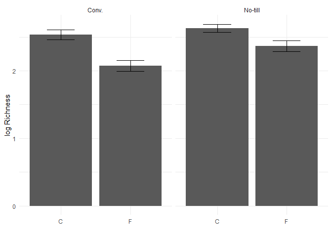
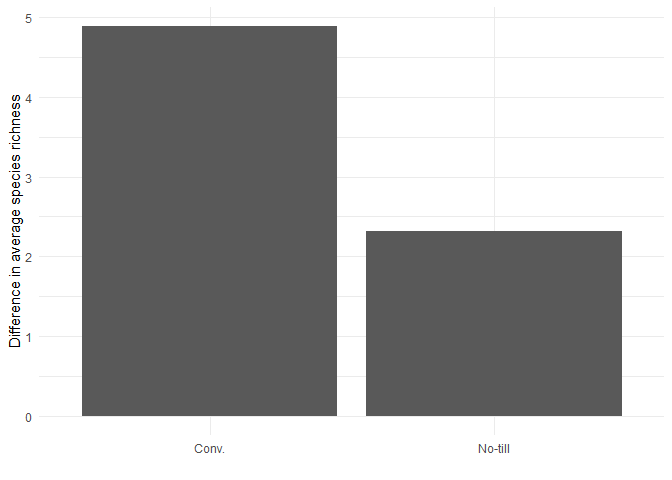

Data wrangling is the idea of manipulating and handling large amount of
messy data.

    library(tidyverse) #It is a bunch of packages and loads-in 8 different packages

    ## ── Attaching core tidyverse packages ──────────────────────── tidyverse 2.0.0 ──
    ## ✔ dplyr     1.1.4     ✔ readr     2.1.5
    ## ✔ forcats   1.0.0     ✔ stringr   1.5.1
    ## ✔ ggplot2   3.5.1     ✔ tibble    3.2.1
    ## ✔ lubridate 1.9.4     ✔ tidyr     1.3.1
    ## ✔ purrr     1.0.4     
    ## ── Conflicts ────────────────────────────────────────── tidyverse_conflicts() ──
    ## ✖ dplyr::filter() masks stats::filter()
    ## ✖ dplyr::lag()    masks stats::lag()
    ## ℹ Use the conflicted package (<http://conflicted.r-lib.org/>) to force all conflicts to become errors

    #same people who made Rstudio made tidyverse

\#some functions covered: mutate() select() filter() pipe %&gt;%
summarise() group\_by() joining pivoting Integration with plotting

    #load data
    microbiome.fungi <- read.csv("05_DataWrangling/Bull_richness.csv", na.strings = "na")
    #look structure of data
    str(microbiome.fungi)

    ## 'data.frame':    287 obs. of  16 variables:
    ##  $ SampleID       : chr  "Corn2017LeafObjective2Collection1T1R1CAH2" "Corn2017LeafObjective2Collection1T1R1CBA3" "Corn2017LeafObjective2Collection1T1R1CCB3" "Corn2017LeafObjective2Collection1T1R1FAC3" ...
    ##  $ Crop           : chr  "Corn" "Corn" "Corn" "Corn" ...
    ##  $ Objective      : chr  "Objective 2" "Objective 2" "Objective 2" "Objective 2" ...
    ##  $ Collection     : int  1 1 1 1 1 1 1 1 1 1 ...
    ##  $ Compartment    : chr  "Leaf" "Leaf" "Leaf" "Leaf" ...
    ##  $ DateSampled    : chr  "6/26/17" "6/26/17" "6/26/17" "6/26/17" ...
    ##  $ GrowthStage    : chr  "V6" "V6" "V6" "V6" ...
    ##  $ Treatment      : chr  "Conv." "Conv." "Conv." "Conv." ...
    ##  $ Rep            : chr  "R1" "R1" "R1" "R1" ...
    ##  $ Sample         : chr  "A" "B" "C" "A" ...
    ##  $ Fungicide      : chr  "C" "C" "C" "F" ...
    ##  $ Target_organism: chr  "Fungi" "Fungi" "Fungi" "Fungi" ...
    ##  $ Location       : chr  "Kellogg Biological Station" "Kellogg Biological Station" "Kellogg Biological Station" "Kellogg Biological Station" ...
    ##  $ Experiment     : chr  "LTER" "LTER" "LTER" "LTER" ...
    ##  $ Year           : int  2017 2017 2017 2017 2017 2017 2017 2017 2017 2017 ...
    ##  $ richness       : int  9 6 5 7 4 2 3 8 4 4 ...

## Using select() function

Select help to select only the certain column of your data that you want
to use for analysis. “:” is used to specify the range of columns in
between the two mentioned with it.

    microbiome.fungi2 <- select(microbiome.fungi, SampleID, Crop, Compartment:Fungicide, richness)

## Using filter() function

to subset data

    head(filter(microbiome.fungi2, Treatment == "Conv."))

    ##                                    SampleID Crop Compartment DateSampled
    ## 1 Corn2017LeafObjective2Collection1T1R1CAH2 Corn        Leaf     6/26/17
    ## 2 Corn2017LeafObjective2Collection1T1R1CBA3 Corn        Leaf     6/26/17
    ## 3 Corn2017LeafObjective2Collection1T1R1CCB3 Corn        Leaf     6/26/17
    ## 4 Corn2017LeafObjective2Collection1T1R1FAC3 Corn        Leaf     6/26/17
    ## 5 Corn2017LeafObjective2Collection1T1R1FBD3 Corn        Leaf     6/26/17
    ## 6 Corn2017LeafObjective2Collection1T1R1FCE3 Corn        Leaf     6/26/17
    ##   GrowthStage Treatment Rep Sample Fungicide richness
    ## 1          V6     Conv.  R1      A         C        9
    ## 2          V6     Conv.  R1      B         C        6
    ## 3          V6     Conv.  R1      C         C        5
    ## 4          V6     Conv.  R1      A         F        7
    ## 5          V6     Conv.  R1      B         F        4
    ## 6          V6     Conv.  R1      C         F        2

    #A more complex using "&"
    head(filter(microbiome.fungi2, Treatment == "Conv." & Fungicide == "C"))

    ##                                    SampleID Crop Compartment DateSampled
    ## 1 Corn2017LeafObjective2Collection1T1R1CAH2 Corn        Leaf     6/26/17
    ## 2 Corn2017LeafObjective2Collection1T1R1CBA3 Corn        Leaf     6/26/17
    ## 3 Corn2017LeafObjective2Collection1T1R1CCB3 Corn        Leaf     6/26/17
    ## 4 Corn2017LeafObjective2Collection1T1R2CAF3 Corn        Leaf     6/26/17
    ## 5 Corn2017LeafObjective2Collection1T1R2CBG3 Corn        Leaf     6/26/17
    ## 6 Corn2017LeafObjective2Collection1T1R2CCH3 Corn        Leaf     6/26/17
    ##   GrowthStage Treatment Rep Sample Fungicide richness
    ## 1          V6     Conv.  R1      A         C        9
    ## 2          V6     Conv.  R1      B         C        6
    ## 3          V6     Conv.  R1      C         C        5
    ## 4          V6     Conv.  R2      A         C        3
    ## 5          V6     Conv.  R2      B         C        8
    ## 6          V6     Conv.  R2      C         C        4

    #Another more complex using or "|"
    head(filter(microbiome.fungi2, Sample == "A"| Sample == "B")) #sample A or B

    ##                                    SampleID Crop Compartment DateSampled
    ## 1 Corn2017LeafObjective2Collection1T1R1CAH2 Corn        Leaf     6/26/17
    ## 2 Corn2017LeafObjective2Collection1T1R1CBA3 Corn        Leaf     6/26/17
    ## 3 Corn2017LeafObjective2Collection1T1R1FAC3 Corn        Leaf     6/26/17
    ## 4 Corn2017LeafObjective2Collection1T1R1FBD3 Corn        Leaf     6/26/17
    ## 5 Corn2017LeafObjective2Collection1T1R2CAF3 Corn        Leaf     6/26/17
    ## 6 Corn2017LeafObjective2Collection1T1R2CBG3 Corn        Leaf     6/26/17
    ##   GrowthStage Treatment Rep Sample Fungicide richness
    ## 1          V6     Conv.  R1      A         C        9
    ## 2          V6     Conv.  R1      B         C        6
    ## 3          V6     Conv.  R1      A         F        7
    ## 4          V6     Conv.  R1      B         F        4
    ## 5          V6     Conv.  R2      A         C        3
    ## 6          V6     Conv.  R2      B         C        8

## Using mutate() function

allows to quickly create new columns

    #Create new column called logRich
    head(mutate(microbiome.fungi2, logRich = log(richness)))

    ##                                    SampleID Crop Compartment DateSampled
    ## 1 Corn2017LeafObjective2Collection1T1R1CAH2 Corn        Leaf     6/26/17
    ## 2 Corn2017LeafObjective2Collection1T1R1CBA3 Corn        Leaf     6/26/17
    ## 3 Corn2017LeafObjective2Collection1T1R1CCB3 Corn        Leaf     6/26/17
    ## 4 Corn2017LeafObjective2Collection1T1R1FAC3 Corn        Leaf     6/26/17
    ## 5 Corn2017LeafObjective2Collection1T1R1FBD3 Corn        Leaf     6/26/17
    ## 6 Corn2017LeafObjective2Collection1T1R1FCE3 Corn        Leaf     6/26/17
    ##   GrowthStage Treatment Rep Sample Fungicide richness   logRich
    ## 1          V6     Conv.  R1      A         C        9 2.1972246
    ## 2          V6     Conv.  R1      B         C        6 1.7917595
    ## 3          V6     Conv.  R1      C         C        5 1.6094379
    ## 4          V6     Conv.  R1      A         F        7 1.9459101
    ## 5          V6     Conv.  R1      B         F        4 1.3862944
    ## 6          V6     Conv.  R1      C         F        2 0.6931472

    #using base R
    microbiome.fungi2$logRich <- log(microbiome.fungi2$richness)

    #Creating a new colum which combines Crop and Treatment
    head(mutate(microbiome.fungi2, Crop_Treatment = paste(Crop, Treatment)))

    ##                                    SampleID Crop Compartment DateSampled
    ## 1 Corn2017LeafObjective2Collection1T1R1CAH2 Corn        Leaf     6/26/17
    ## 2 Corn2017LeafObjective2Collection1T1R1CBA3 Corn        Leaf     6/26/17
    ## 3 Corn2017LeafObjective2Collection1T1R1CCB3 Corn        Leaf     6/26/17
    ## 4 Corn2017LeafObjective2Collection1T1R1FAC3 Corn        Leaf     6/26/17
    ## 5 Corn2017LeafObjective2Collection1T1R1FBD3 Corn        Leaf     6/26/17
    ## 6 Corn2017LeafObjective2Collection1T1R1FCE3 Corn        Leaf     6/26/17
    ##   GrowthStage Treatment Rep Sample Fungicide richness   logRich Crop_Treatment
    ## 1          V6     Conv.  R1      A         C        9 2.1972246     Corn Conv.
    ## 2          V6     Conv.  R1      B         C        6 1.7917595     Corn Conv.
    ## 3          V6     Conv.  R1      C         C        5 1.6094379     Corn Conv.
    ## 4          V6     Conv.  R1      A         F        7 1.9459101     Corn Conv.
    ## 5          V6     Conv.  R1      B         F        4 1.3862944     Corn Conv.
    ## 6          V6     Conv.  R1      C         F        2 0.6931472     Corn Conv.

## Using pipe %&gt;% function

Very useful and important for alot of things It combines output for one
function (from right side of pipe) to input for another function (in the
left of pipe). It helps to visualize what you are doing to your data in
each step. It doesnot necessarily create column in the original dataset,
just manipulate data till running analysis in a way we want it to.

    microbiome.fungi %>%
      select(SampleID, Crop, Compartment:Fungicide, richness) %>%
      filter(Treatment == "Conv.") %>% 
      mutate(logRich = log(richness)) %>% 
      head()

    ##                                    SampleID Crop Compartment DateSampled
    ## 1 Corn2017LeafObjective2Collection1T1R1CAH2 Corn        Leaf     6/26/17
    ## 2 Corn2017LeafObjective2Collection1T1R1CBA3 Corn        Leaf     6/26/17
    ## 3 Corn2017LeafObjective2Collection1T1R1CCB3 Corn        Leaf     6/26/17
    ## 4 Corn2017LeafObjective2Collection1T1R1FAC3 Corn        Leaf     6/26/17
    ## 5 Corn2017LeafObjective2Collection1T1R1FBD3 Corn        Leaf     6/26/17
    ## 6 Corn2017LeafObjective2Collection1T1R1FCE3 Corn        Leaf     6/26/17
    ##   GrowthStage Treatment Rep Sample Fungicide richness   logRich
    ## 1          V6     Conv.  R1      A         C        9 2.1972246
    ## 2          V6     Conv.  R1      B         C        6 1.7917595
    ## 3          V6     Conv.  R1      C         C        5 1.6094379
    ## 4          V6     Conv.  R1      A         F        7 1.9459101
    ## 5          V6     Conv.  R1      B         F        4 1.3862944
    ## 6          V6     Conv.  R1      C         F        2 0.6931472

## Using summarise() function

To find means, standard deviations/errors

    microbiome.fungi %>% 
      select(SampleID, Crop, Compartment:Fungicide, richness) %>%
      filter(Treatment == "Conv.") %>% 
      mutate(logRich = log(richness)) %>% 
      summarise(Mean.Rich = mean(logRich))#calculate the overall mean of log richness within the selected treatment

    ##   Mean.Rich
    ## 1  2.304395

We can also combine multiple summary statistics

    microbiome.fungi %>% 
      select(SampleID, Crop, Compartment:Fungicide, richness) %>%
      filter(Treatment == "Conv.") %>% 
      mutate(logRich = log(richness)) %>% 
      summarise(Mean.Rich = mean(logRich),
                n = n(),
                sd.dev = sd(logRich)) %>% # n() counts number of rows, sd calculate standard deviation and store in the object sd.dev
      mutate(std.err = sd.dev/sqrt(n)) #add new column for standard error

    ##   Mean.Rich   n    sd.dev   std.err
    ## 1  2.304395 144 0.7024667 0.0585389

    #trick:  select the section till where you want to see the pipe function working

## Using group\_by() function

to summarise the statistics according to the groupt you want to see.

    microbiome.fungi %>% 
      select(SampleID, Crop, Compartment:Fungicide, richness) %>%
      group_by(Treatment, Fungicide) %>% #grouping by treatment and fungicide to later calculate summary stats
      mutate(logRich = log(richness)) %>% 
      summarise(Mean.Rich = mean(logRich),
                n = n(),
                sd.dev = sd(logRich)) %>% 
      mutate(std.err = sd.dev/sqrt(n))

    ## `summarise()` has grouped output by 'Treatment'. You can override using the
    ## `.groups` argument.

    ## # A tibble: 4 × 6
    ## # Groups:   Treatment [2]
    ##   Treatment Fungicide Mean.Rich     n sd.dev std.err
    ##   <chr>     <chr>         <dbl> <int>  <dbl>   <dbl>
    ## 1 Conv.     C              2.53    72  0.635  0.0748
    ## 2 Conv.     F              2.07    72  0.696  0.0820
    ## 3 No-till   C              2.63    72  0.513  0.0604
    ## 4 No-till   F              2.36    71  0.680  0.0807

## Connecting to plotting

We can integrate all the above function in ggplot itself using pipe, and
we could use the seleced/mutated/grouped data into the plot where we
would not have to mention data frame

    microbiome.fungi %>% 
      select(SampleID, Crop, Compartment:Fungicide, richness) %>%
      group_by(Treatment, Fungicide) %>% #grouping by treatment and fungicide to later calculate summary stats
      mutate(logRich = log(richness)) %>% 
      summarise(Mean.Rich = mean(logRich),
                n = n(),
                sd.dev = sd(logRich)) %>% 
      mutate(std.err = sd.dev/sqrt(n)) %>% 
      ggplot(aes(x = Fungicide, y = Mean.Rich)) + #adding the function to ggplot
      geom_bar(stat = "identity") +
      geom_errorbar(aes(x= Fungicide, ymin= Mean.Rich-std.err, ymax = Mean.Rich+std.err), width = 0.4) +
      theme_minimal() +
      xlab("")+
      ylab("log Richness") +
      facet_wrap(~Treatment)

    ## `summarise()` has grouped output by 'Treatment'. You can override using the
    ## `.groups` argument.

## Joining

The join group of functions are super useful. Have you ever tried to
match up data by rows based on some criteria? It’s almost impossible to
mess up over 10-15 rows of data.

More info can be found here:
<https://dplyr.tidyverse.org/reference/mutate-joins.htmlLinks> to an
external site.

But we can easily do this with the joining functions. They include:

-   left\_join() - Keep all rows of X and add matching rows from Y. Any
    rows in Y that don’t match X are excluded.

-   right\_join() - reverse of left\_join()

-   inner\_join() - only keep rows that are common to both X AND Y,
    remove everything else.

-   full\_join() - Keep any columns that are in either X or Y

To try these out, let’s split our data into separate sets, including
taxonomy and metadata.

Here we are also randomly sampling 100 different samples using
“sample\_n()” function

    # selecting just the richness and sample ID
    richness <- microbiome.fungi %>%
      select(SampleID, richness)

    # selecting columns that don't include the richness
    metadata <- microbiome.fungi %>% 
      select(SampleID, Fungicide, Crop, Compartment, GrowthStage, Treatment, Rep, Sample)

    head(metadata)

    ##                                    SampleID Fungicide Crop Compartment
    ## 1 Corn2017LeafObjective2Collection1T1R1CAH2         C Corn        Leaf
    ## 2 Corn2017LeafObjective2Collection1T1R1CBA3         C Corn        Leaf
    ## 3 Corn2017LeafObjective2Collection1T1R1CCB3         C Corn        Leaf
    ## 4 Corn2017LeafObjective2Collection1T1R1FAC3         F Corn        Leaf
    ## 5 Corn2017LeafObjective2Collection1T1R1FBD3         F Corn        Leaf
    ## 6 Corn2017LeafObjective2Collection1T1R1FCE3         F Corn        Leaf
    ##   GrowthStage Treatment Rep Sample
    ## 1          V6     Conv.  R1      A
    ## 2          V6     Conv.  R1      B
    ## 3          V6     Conv.  R1      C
    ## 4          V6     Conv.  R1      A
    ## 5          V6     Conv.  R1      B
    ## 6          V6     Conv.  R1      C

    head(richness)

    ##                                    SampleID richness
    ## 1 Corn2017LeafObjective2Collection1T1R1CAH2        9
    ## 2 Corn2017LeafObjective2Collection1T1R1CBA3        6
    ## 3 Corn2017LeafObjective2Collection1T1R1CCB3        5
    ## 4 Corn2017LeafObjective2Collection1T1R1FAC3        7
    ## 5 Corn2017LeafObjective2Collection1T1R1FBD3        4
    ## 6 Corn2017LeafObjective2Collection1T1R1FCE3        2

    head(left_join(metadata, richness, by = "SampleID")) # adding the richness data to the metadata based on the column od sample ID

    ##                                    SampleID Fungicide Crop Compartment
    ## 1 Corn2017LeafObjective2Collection1T1R1CAH2         C Corn        Leaf
    ## 2 Corn2017LeafObjective2Collection1T1R1CBA3         C Corn        Leaf
    ## 3 Corn2017LeafObjective2Collection1T1R1CCB3         C Corn        Leaf
    ## 4 Corn2017LeafObjective2Collection1T1R1FAC3         F Corn        Leaf
    ## 5 Corn2017LeafObjective2Collection1T1R1FBD3         F Corn        Leaf
    ## 6 Corn2017LeafObjective2Collection1T1R1FCE3         F Corn        Leaf
    ##   GrowthStage Treatment Rep Sample richness
    ## 1          V6     Conv.  R1      A        9
    ## 2          V6     Conv.  R1      B        6
    ## 3          V6     Conv.  R1      C        5
    ## 4          V6     Conv.  R1      A        7
    ## 5          V6     Conv.  R1      B        4
    ## 6          V6     Conv.  R1      C        2

## Pivoting

Pivoting is also useful for converting from wide to long format and back
again. We can do this with pivot\_longer() and pivot\_wider()

More info can be found here:
<https://tidyr.tidyverse.org/reference/pivot_wider.htmlLinks> to an
external site.

I will demonstrate pivot\_wider() assuming that most data is already
formatted as long data. Lets explore turning our data set into a wide
format, since its in long format.

    microbiome.fungi %>% 
      select(SampleID, Crop, Compartment:Fungicide, richness) %>%
      group_by(Treatment, Fungicide) %>% #grouping by treatment and fungicide to later calculate summary stats
      mutate(logRich = log(richness)) %>% 
      summarise(Mean = mean(richness))

    ## `summarise()` has grouped output by 'Treatment'. You can override using the
    ## `.groups` argument.

    ## # A tibble: 4 × 3
    ## # Groups:   Treatment [2]
    ##   Treatment Fungicide  Mean
    ##   <chr>     <chr>     <dbl>
    ## 1 Conv.     C         14.6 
    ## 2 Conv.     F          9.75
    ## 3 No-till   C         15.4 
    ## 4 No-till   F         13.1

### Wide format

-   sets the values within fungicide column into column names
-   Easily can take the difference bewteen the fungicide and control now

<!-- -->

    microbiome.fungi %>% 
      select(SampleID, Crop, Compartment:Fungicide, richness) %>%
      group_by(Treatment, Fungicide) %>% #grouping by treatment and fungicide to later calculate summary stats
      mutate(logRich = log(richness)) %>% 
      summarise(Mean = mean(richness)) %>% 
      pivot_wider(names_from = Fungicide, values_from = Mean) 

    ## `summarise()` has grouped output by 'Treatment'. You can override using the
    ## `.groups` argument.

    ## # A tibble: 2 × 3
    ## # Groups:   Treatment [2]
    ##   Treatment     C     F
    ##   <chr>     <dbl> <dbl>
    ## 1 Conv.      14.6  9.75
    ## 2 No-till    15.4 13.1

-   We can integrate the difference into the plot too

<!-- -->

    microbiome.fungi %>%
      select(SampleID, Crop, Compartment:Fungicide, richness) %>% 
      group_by(Treatment, Fungicide) %>% 
      summarise(Mean = mean(richness)) %>% 
      pivot_wider(names_from = Fungicide, values_from = Mean) %>% 
      mutate(diff.fungicide = C - F) %>%  # calculate the difference between the means. 
      ggplot(aes(x = Treatment, y = diff.fungicide)) + # Plot it 
      geom_col() +
      theme_minimal() +
      xlab("") +
      ylab("Difference in average species richness")

    ## `summarise()` has grouped output by 'Treatment'. You can override using the
    ## `.groups` argument.

