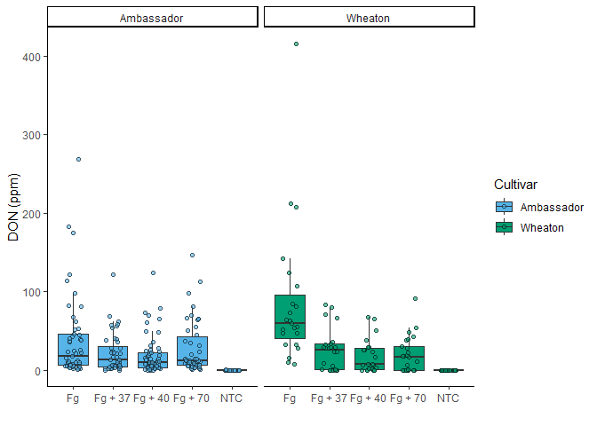
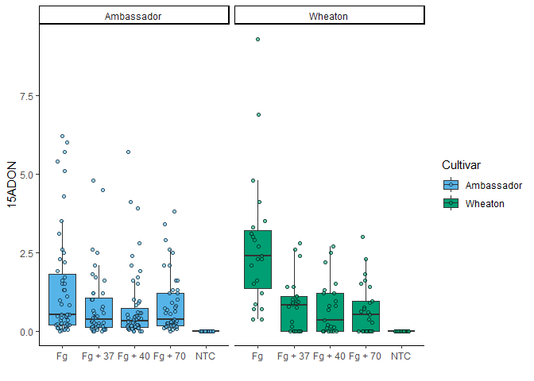

## Clickable link to the manuscript

[DOI](https://doi.org/10.1094/PDIS-06-21-1253-RE)

## Read data

``` r
#read data
Mycotoxin <- read.csv("03_Visualization/MycotoxinData.csv",
                      na.strings = "na")
#load library
library(ggplot2)
```

## Plot DON

``` r
#load pallette
cbbPalette <- c("#56B4E9", "#009E73", "#F0E442", "#0072B2", "#D55E00", "#CC79A7")
#making box plot
DON <- ggplot(Mycotoxin, aes(x = Treatment, 
                             y = DON, 
                             fill = Cultivar))+
  geom_boxplot(outlier.shape = NA)+
  #removing NA outliers from the boxplot
  geom_point(shape = 21, color = "black", 
             position = position_jitterdodge(dodge.width = 0.9),
             alpha = 0.6 )+ 
  #giving shape to fill the color and dodge away from the bar plot, alpha value provides transparency to the points
  scale_fill_manual(values = cbbPalette)+
  theme_classic()+
  xlab("")+
  ylab("DON (ppm)")+
  facet_wrap(~Cultivar)
#facet wrap according to the Cultivar, here I didnot use scale free since all all the plot space is used.
DON
```

    ## Warning: Removed 8 rows containing non-finite outside the scale range
    ## (`stat_boxplot()`).

    ## Warning: Removed 8 rows containing missing values or values outside the scale range
    ## (`geom_point()`).

<!-- -->
\## Plot X15ADON

``` r
#making y-axis as 15ADON 
X15ADON <- ggplot(Mycotoxin, aes(Treatment, 
                                 X15ADON, 
                                 fill = Cultivar))+
  #change x axis only since the data is ordered for that column
  geom_boxplot(outlier.shape = NA)+ #removing NA outliers from the boxplot
  geom_point(shape = 21, color = "black",
             position = position_jitterdodge(dodge.width = 0.9), 
             alpha=0.6 )+ 
  scale_fill_manual(values = cbbPalette)+
  theme_classic()+
  xlab("")+
  ylab("15ADON")+
  facet_wrap(~Cultivar)
X15ADON
```

    ## Warning: Removed 10 rows containing non-finite outside the scale range
    ## (`stat_boxplot()`).

    ## Warning: Removed 10 rows containing missing values or values outside the scale range
    ## (`geom_point()`).

<!-- -->

## Plot Seed mass

``` r
#making y-axis as mass per seed
Seedmass <- ggplot(Mycotoxin, aes(Treatment,
                                  MassperSeed_mg,
                                  fill = Cultivar))+ 
  geom_boxplot(outlier.shape = NA)+
  geom_point(shape = 21, color = "black", 
             position = position_jitterdodge(dodge.width = 0.9),
             alpha=0.6 )+
  scale_fill_manual(values = cbbPalette)+
  theme_classic()+
  xlab("")+
  ylab("Seed Mass (mg)")+
  facet_wrap(~Cultivar)
Seedmass
```

    ## Warning: Removed 2 rows containing non-finite outside the scale range
    ## (`stat_boxplot()`).

    ## Warning: Removed 2 rows containing missing values or values outside the scale range
    ## (`geom_point()`).

<!-- -->

## Combine plots

``` r
#load library 
library(ggpubr)

DON_stat <- DON+
  geom_pwc(aes(group = Treatment),
           method = "t.test", 
           label = "{p.adj.format}.{p.adj.signif}",
           hide.ns = T)
# takes Treatment as a group to compare using t-test and provides label for p-adjusted value and significance. It was looking busy so I removes the ns using hide.ns

X15ADON_stat <- X15ADON+
  geom_pwc(aes(group = Treatment),
           method = "t.test",
           label = "{p.adj.format}.{p.adj.signif}", 
           hide.ns = T)

Seedmass_stat <- Seedmass+
  geom_pwc(aes(group = Treatment), 
           method = "t.test", 
           label = "{p.adj.format}.{p.adj.signif}", 
           hide.ns = T)


stat_plot <- ggarrange(
  DON_stat,
  X15ADON_stat,
  Seedmass_stat,
  ncol = 3,
  nrow = 1,
  labels = c("A", "B", "C"), #we can also provide label to the plot manually
  common.legend = T
)
```

    ## Warning: Removed 8 rows containing non-finite outside the scale range
    ## (`stat_boxplot()`).

    ## Warning: Removed 8 rows containing non-finite outside the scale range
    ## (`stat_pwc()`).

    ## Warning: Removed 8 rows containing missing values or values outside the scale range
    ## (`geom_point()`).

    ## Warning: Removed 8 rows containing non-finite outside the scale range
    ## (`stat_boxplot()`).

    ## Warning: Removed 8 rows containing non-finite outside the scale range
    ## (`stat_pwc()`).

    ## Warning: Removed 8 rows containing missing values or values outside the scale range
    ## (`geom_point()`).

    ## Warning: Removed 10 rows containing non-finite outside the scale range
    ## (`stat_boxplot()`).

    ## Warning: Removed 10 rows containing non-finite outside the scale range
    ## (`stat_pwc()`).

    ## Warning: Removed 10 rows containing missing values or values outside the scale range
    ## (`geom_point()`).

    ## Warning: Removed 2 rows containing non-finite outside the scale range
    ## (`stat_boxplot()`).

    ## Warning: Removed 2 rows containing non-finite outside the scale range
    ## (`stat_pwc()`).

    ## Warning: Removed 2 rows containing missing values or values outside the scale range
    ## (`geom_point()`).

``` r
stat_plot
```

<!-- -->
